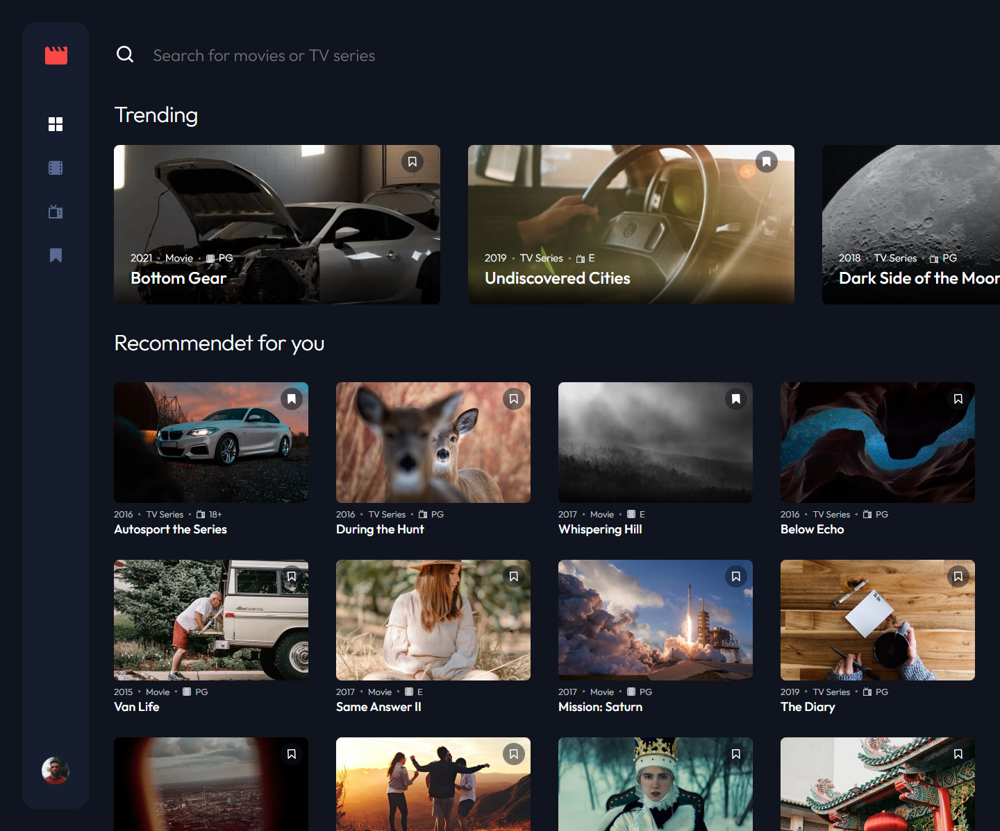

# Frontend Mentor - Entertainment Web App solution

This is a solution to the [Entertainment web app challenge on Frontend Mentor](https://www.frontendmentor.io/challenges/entertainment-web-app-J-UhgAW1X).

Frontend Mentor challenges help me improve my coding skills by building realistic project.

### Screenshot

### Links

- Solution URL: [SOLUTION!!!](https://www.frontendmentor.io/solutions/nextjs-graphql-nexus-prisma-mongodb-typescript-fullstack-app-MuwwO803pv)!
- Live Site URL: [LIVE!!!](https://entertainment-app-ivcenko.vercel.app)

### Built with

- [NextJs](https://nextjs.org/) - The React Framework for Production
- [TypeScript](https://www.typescriptlang.org/) - For types
- [NextAuth](https://next-auth.js.org/) - For authentication
- [Prisma](https://www.prisma.io/) - Data modeling, migrations, and data access databases
- [RTK Query](https://redux-toolkit.js.org/rtk-query/overview) - Data fetching and caching tool.
- [SASS](https://sass-lang.com/) - For styles
- Flexbox
- CSS Grid
- Mobile-first workflow

## Author

- Website - [Sergejs Ivcenko](https://www.ivcenko.ie)
- Frontend Mentor - [@Sergio0831](https://www.frontendmentor.io/profile/Sergio0831)

